## Garage
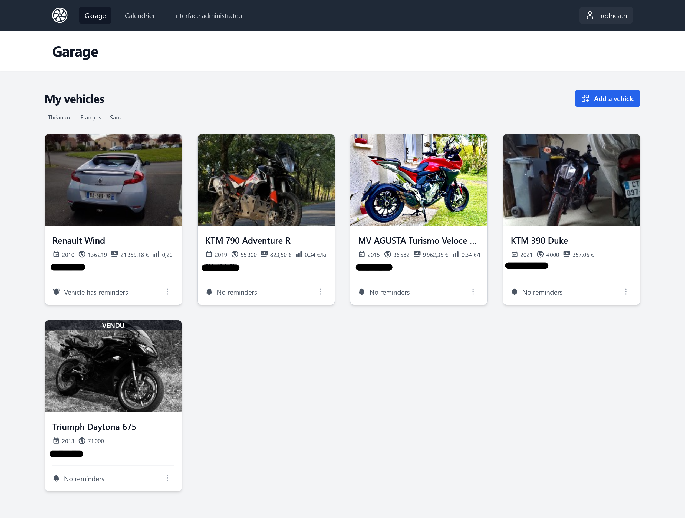
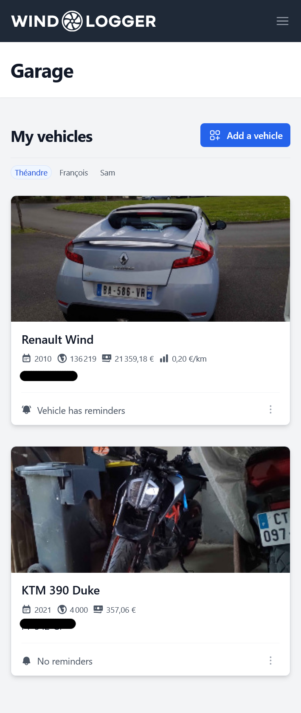

### Before

## Planner(Kanban Board)
Not done yet!

### Before

## Dashboard
> [!NOTE]  
> This is still a work in progress 😉

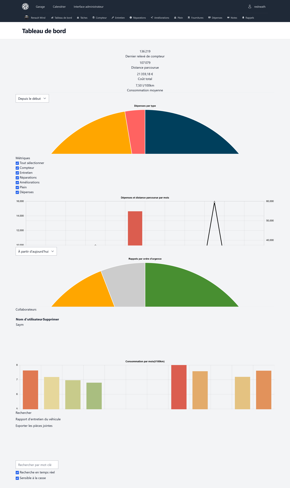
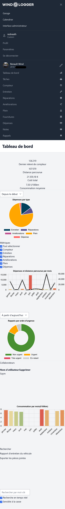

### Before

## Track Service Records / Repairs / Upgrades
Not done yet!

### Before

## Attach Files to Records (i.e.: Receipts, Invoices, etc)
Not done yet!

### Before

## Import/Export from/to CSV (Supports Imports from Fuelly)
Note done yet!

### Before

## Track Gas Records(Supports MPG, L/100KM)

Supports
- MPG
- L/100KM and KM/L
- British use-case: Purchase gas in liters and calculate fuel economy in miles per UK Gallon(imp gal)

Not done yet!

### Before

## Reminders
Not done yet!

### Before

## Set Reminders based on Odometer, Date, or whichever comes first
Not done yet!

### Before

## Settings
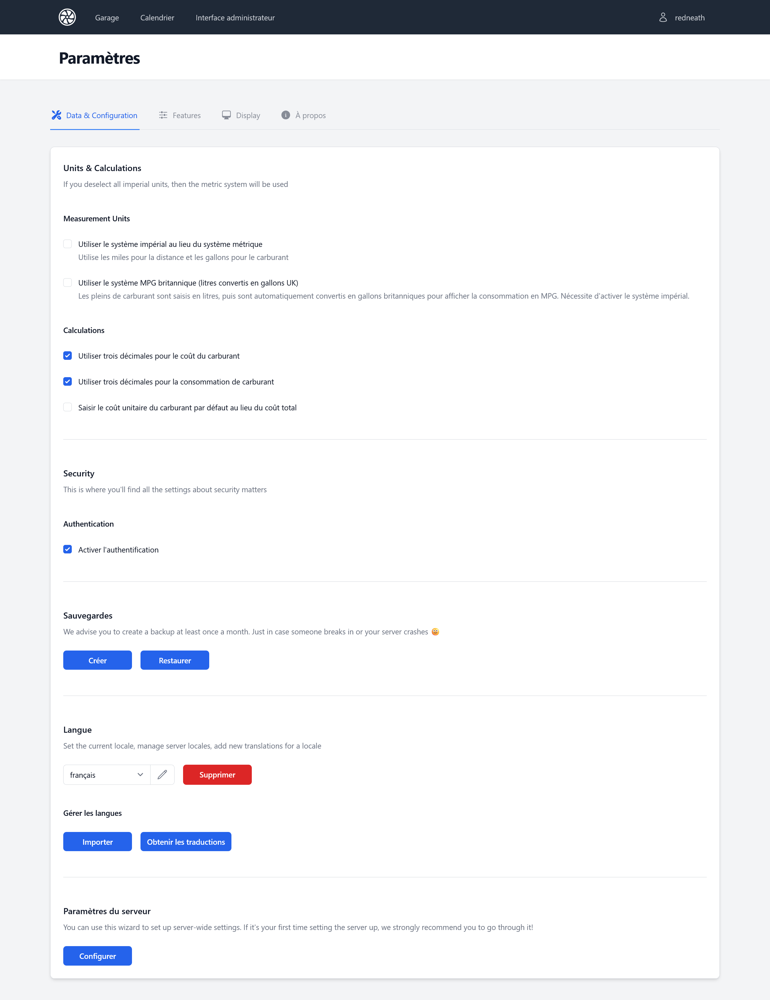
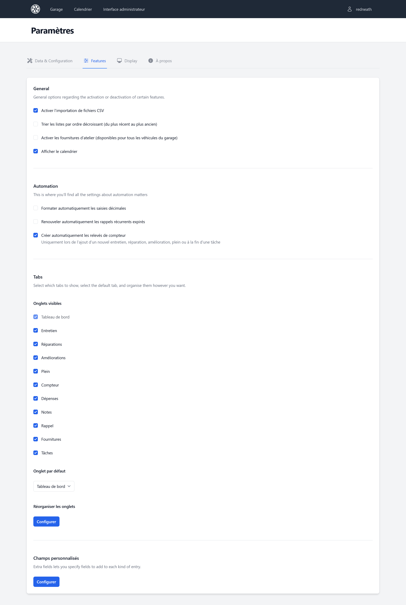
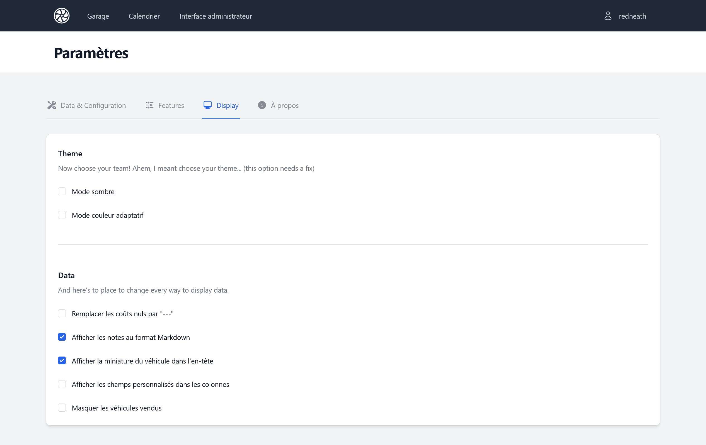
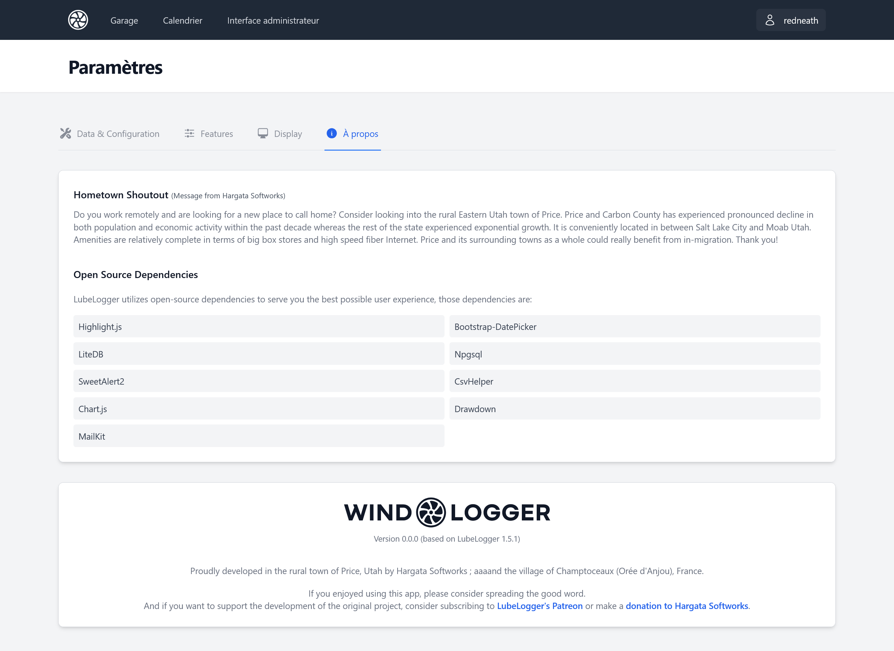
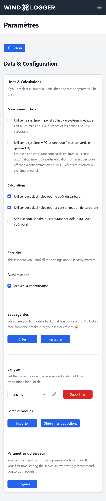
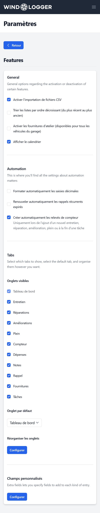
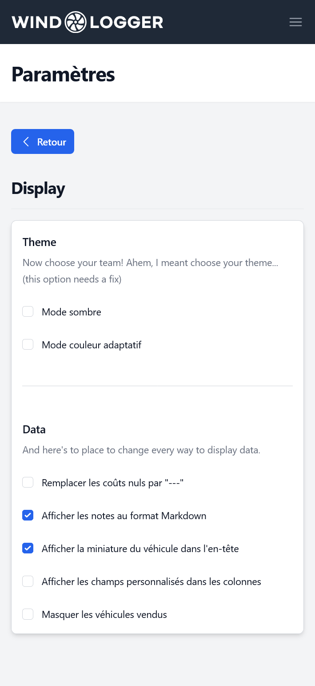
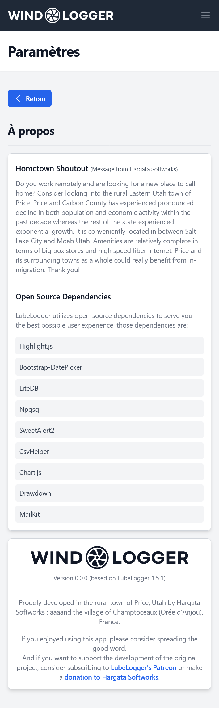

### Before

## Admin Panel (Generate Tokens for new users to sign up)
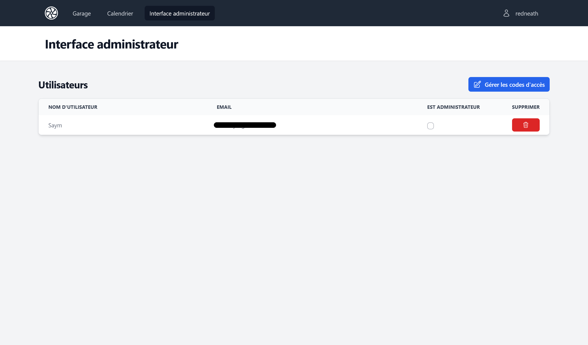
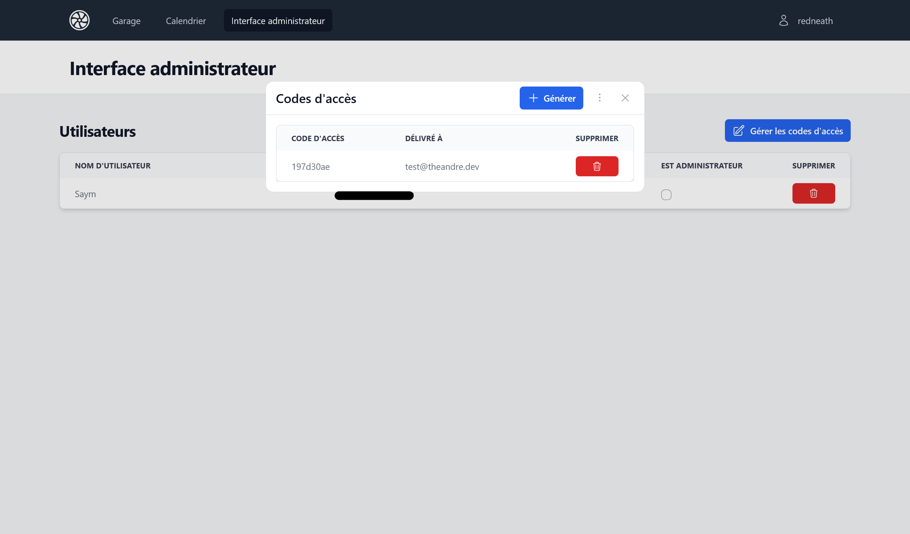
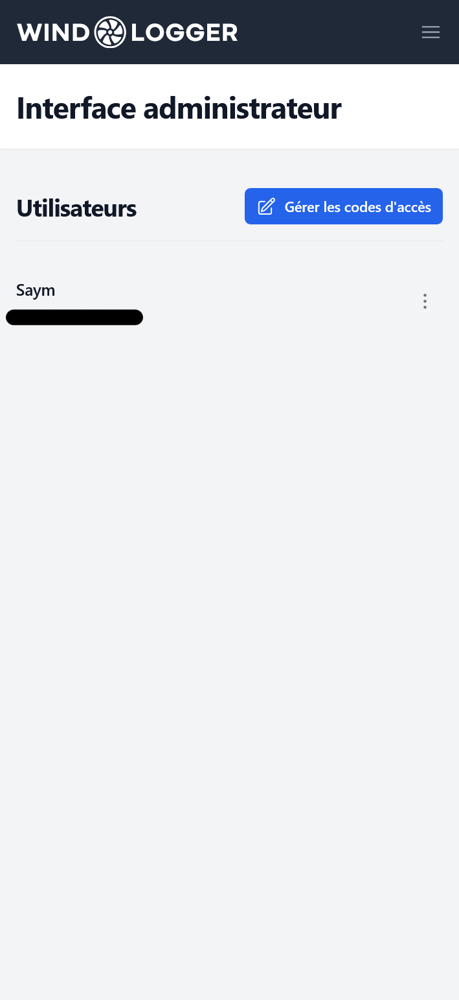
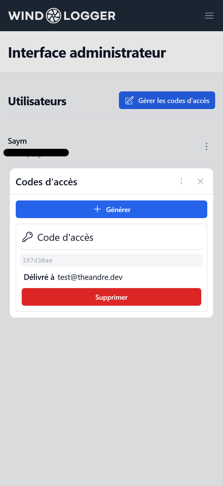

### Before

## Token Based Registration for New Users

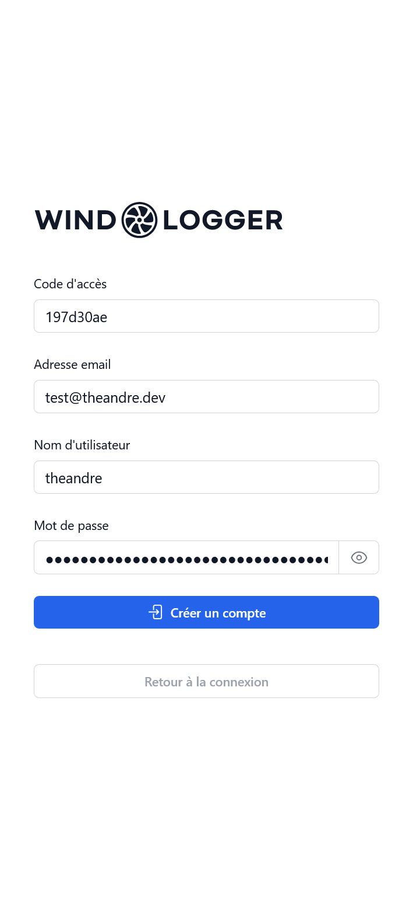

### Before

## Track Supplies and Parts purchased for your vehicle
Not done yet!

### Before

## Supports Custom Fields
Not done yet!

### Before

## Add Collaborators (Multiple People can Add/Edit Records for same Vehicle)
Not done yet!

### Before

## Consolidated Vehicle Maintenance Report
Not done yet!

### Before

